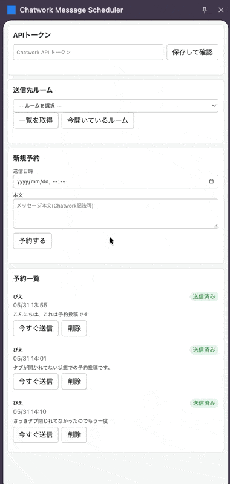

# Chatwork Message Scheduler

_[English](./README.md) | [日本語](./README.ja.md)_

> A Chrome extension that schedules Chatwork messages and sends them automatically at a date
> and time you choose. Set it once from the side panel and forget it.

<!-- デモ GIF をここに置きます: docs/demo.gif -->



## Features

- Schedule a message to be sent at a specified date and time
- Pick the target room from a list, or grab the room you currently have open in one click
- View, edit, delete, and send-now your scheduled messages
- Reservations persist across browser and PC restarts

## Setup

```sh
pnpm install
pnpm build
```

Then open `chrome://extensions`, turn on **Developer mode**, click **Load unpacked**, and
select the `dist` folder.

## How to use

1. Open the side panel from the extension icon.
2. Issue a [Chatwork API token](https://www.chatwork.com/service/packages/chatwork/subpackages/api/token.php) and save it in the panel.
3. Choose the target room, date/time, and message body, then schedule it.
4. The message is sent automatically at the scheduled time. Check its status in the list.

<!-- サイドパネルのスクリーンショットをここに: docs/sidepanel.png -->


## Notes

- Messages are sent only while Chrome is running. A reservation whose time passes while Chrome
  is closed is sent the next time Chrome starts.
- The scheduled time is interpreted in your device's local timezone.
- A Chatwork API token is required.

## For developers

See [CLAUDE.md](./CLAUDE.md).

## License

[MIT](./LICENSE) © 2026 kokoichi206
